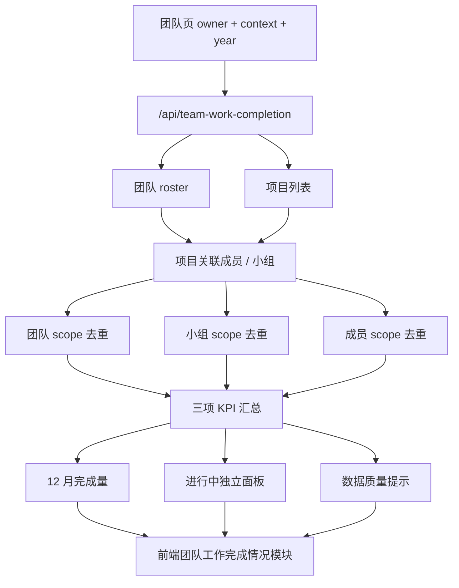

# 团队工作完成情况模块重构实施计划

> 状态日期：2026-06-10  
> 方案选择：方案 C，干净重建主模块，旧口径保留为 legacy 能力但不再驱动当前页面主展示  
> 目标页面：团队页中的“人员 + 负载”区域，重构为“团队工作完成情况”单一大模块

## 1. 背景与目标

当前页面把“人员、负载、负责人复盘、历史完成、关联记录”混在一个以负载为中心的模块里，业务意图已经偏离实际需求。新的总监口径不是看“谁真实负责了多少负载”，而是看公司层面的项目工作完成情况，并按负责人、团队、小组、成员做筛选聚合。

本次重构的核心目标：

- 页面主语从“人员 + 负载”改为“团队工作完成情况”。
- KPI 闭环只有一个当前主口径：公司层面的项目闭环。
- 公司层面的项目闭环按硬装、软装任一轨道精确闭环认定；睡眠店等特殊项目按既有硬装单轨规则处理。
- 旧的“设计责任闭环”逻辑保留，但不在当前团队工作完成情况模块中作为独立统计口径展示。
- 团队、小组、成员之间必须形成同一套统计链路：成员关联项目，小组汇总成员项目，团队汇总所有小组项目。
- 图表展示 1-12 月三项完成量，同时把进行中状态独立展示，避免把进行中混入柱状图。

最终希望这个模块回答三个问题：

1. 这个团队整体今年每月完成了多少工作？
2. 每个小组分别完成了多少，哪些还在推进？
3. 每个成员与哪些项目有关，完成、进行中、数据异常分别是什么状态？

## 2. 多 Agent 复盘结论

本次需求按四个视角拆分复盘，避免只从单一开发视角理解需求。

### 2.1 产品 / 使用者 Agent

使用者真正关心的是“完成情况”，不是“负载满不满”。因此首屏应该弱化旧的负载术语，突出团队、小组、成员三层完成情况。

页面应当具备：

- 顶部团队口径总览：三项 KPI 的完成量、进行中量、异常量。
- 团队维度 1-12 月柱状图：只放完成量。
- 进行中独立面板：把平面、摆场、项目闭环的推进中项目数量单独露出。
- 小组卡片：每组展示组长、成员、三项完成量、进行中量、12 月迷你图。
- 成员网格：成员作为最小查询入口，展示关联项目与数据状态。
- 数据质量提示：展示无法映射成员、缺失完成日期、弱项目 key 等问题。

组长现在未完全给出，界面与数据结构应预留 `leadDisplay`，默认展示“组长未配置”，不能因为缺组长阻塞模块。

### 2.2 后端 / 统计口径 Agent

当前已有两套闭环口径：

- 公司流程闭环：看硬装项目进度、软装项目进度。
- 设计责任闭环：看设计师责任线是否完成，适合历史或未来责任制统计。

本模块只能使用公司流程闭环作为项目总闭环 KPI。旧责任闭环不删除，但只作为 legacy 能力保留，不进入当前模块主统计。

后端需要新增独立语义层和独立聚合服务，避免复用旧的 `teamResponsibilityReview`、`isDesignResponsibilityClosed` 或旧负载模块逻辑导致口径污染。

关键判断：

- 不应从 `updatedAt`、`dueDate`、`startDate` 推断完成日期。
- 月度图只统计有可靠完成日期的完成项目。
- 总量统计可以统计已完成但缺失日期的项目，同时放入数据质量提示。
- 项目按 scope 去重，同一个项目在团队维度只计一次。
- 同一个项目关联多个小组时，团队计一次，每个相关小组各计一次。

### 2.3 QA / BUG 风险 Agent

最容易出错的地方不是 UI，而是“看起来有数字，但其实口径错了”。

高风险点：

- 把旧负载字段继续当成当前 KPI。
- 把设计责任闭环误当项目总闭环。
- 用更新时间、预计时间兜底完成时间，造成月度图虚假完成。
- 同一项目被同一成员多个字段命中后重复计数。
- 跨小组协作项目在团队、小组之间重复或漏算。
- 停止 / 暂停项目被错误算作进行中。
- 未映射成员姓名静默丢失，导致团队统计缺口不可见。

测试必须覆盖这些风险，而不是只验证接口能返回数据。

### 2.4 迁移 / 架构 Agent

当前代码中旧团队负载、负责人复盘、项目提醒等逻辑仍有历史用途，不能粗暴删除。正确迁移方式是：

- 新增 `/api/team-work-completion`，作为新模块唯一数据入口。
- 保留 `/api/team-responsibility-review`，但前端默认不再调用它驱动团队主页面。
- 新建 `public/pages/team-work-completion.mjs`，让新模块和旧 owner review 页面解耦。
- 在 DOM 上新增 `#teamWorkCompletionModule`，隐藏旧 `#teamLoadModule`。
- 样式使用 `.team-completion-*` 命名空间，避免旧 `.team-load-*` 继续污染。

## 3. 当前系统问题复盘

### 3.1 主语错误

旧模块标题和数据组织以“负载”为主，容易让使用者理解为：

- 当前谁忙不忙；
- 平面方案是否占用设计师；
- 历史完成只是负载的辅助信息。

新需求的主语是“工作完成情况”，负载只可作为辅助背景，不再是模块标题和核心布局。

### 3.2 统计口径混杂

旧实现中存在以下容易混淆的概念：

- 平面完成；
- 摆场完成；
- 公司流程闭环；
- 设计责任闭环；
- 延期未闭环；
- 负责人责任复盘。

这些概念各自有价值，但不能在当前页面并列成多个 KPI 闭环。当前模块只展示：

- 平面方案躺平完成量；
- 方案摆场完成量；
- 项目总闭环情况。

其中“项目总闭环情况”只认公司流程闭环。

### 3.3 月度统计存在伪日期风险

如果为了做 1-12 月图表，从更新时间、创建时间、预计时间推断完成月份，会制造错误 KPI。月度完成量必须只来自可靠完成日期。

可靠日期包括：

- 平面方案明确完成日期；
- 摆场 / 点位 / 软装完成明确日期；
- 硬装、软装闭环对应的明确完成日期或表单闭环时间。

不可靠日期包括：

- 项目更新时间；
- 项目创建时间；
- Deadline；
- 预计开工或预计完成时间；
- 无法证明为完成行为的普通业务日期。

### 3.4 小组和成员关系不应依赖组长

组长信息现在还未完全明确，所以不能让组长成为统计必填项。小组统计应先基于成员和项目关联建立，组长作为展示字段预留。

默认策略：

- 小组存在但无组长：展示“组长未配置”。
- 成员存在但无项目：展示为空数据成员。
- 项目出现未映射人员：进入数据质量提示。

## 4. 术语与口径定义

### 4.1 组织层级

| 术语 | 定义 |
| --- | --- |
| 团队负责人 | 当前页面 owner，例如“苏佳蕾” |
| 团队 | 该负责人下所有小组和小组成员的集合 |
| 小组 | 团队内的直属小组，例如“直营1组” |
| 组长 | 小组负责人，当前可为空，预留展示位 |
| 成员 | 小组内设计师或相关执行人员 |
| 关联项目 | 项目字段中命中团队成员的项目 |

### 4.2 指标层级

| 指标 | 英文字段 | 当前模块含义 |
| --- | --- | --- |
| 平面方案躺平完成量 | `floorPlan` | 平面方案明确完成的项目量 |
| 方案摆场完成量 | `display` | 摆场、点位或软装方案相关完成的项目量 |
| 项目总闭环情况 | `lifecycle` | 公司层面项目闭环，常规项目硬装或软装任一轨道精确闭环 |

### 4.3 闭环层级

| 口径 | 当前模块是否展示 | 用途 |
| --- | --- | --- |
| 公司流程闭环 | 是 | 当前唯一 KPI 闭环 |
| 设计责任闭环 | 否 | legacy 保留，未来责任制统计可能复用 |
| 延期未闭环 | 否，最多作为异常说明 | 说明责任状态，不代表流程未闭环 |

## 5. 统计规则

### 5.1 团队 / 小组 / 成员聚合

聚合规则以“项目关联成员”为起点：

1. 项目字段命中团队内任一成员，则该项目进入团队统计。
2. 项目字段命中某小组成员，则该项目进入该小组统计。
3. 项目字段命中某成员，则该项目进入该成员统计。
4. 同一项目在同一 scope 内只计一次。
5. 同一项目跨多个小组时：
   - 团队维度计一次；
   - 每个命中的小组各计一次；
   - 每个命中的成员各计一次。

这个规则保证团队数字代表“团队参与过的不同项目”，小组数字代表“小组参与过的不同项目”，成员数字代表“成员参与过的不同项目”。

### 5.2 平面方案躺平完成量

完成判断：

- 平面方案状态明确为完成、已完成、躺平完成、完成上会、完成量尺等完成语义；
- 或既有字段中有明确平面完成日期。

进行中判断：

- 平面方案状态明确为进行中、施工中、推进中、未完成但已启动等；
- 暂停、停止、废弃、未开始不算进行中。

月度归属：

- 只使用明确平面完成日期；
- 无完成日期的已完成项目进入总完成量，但不进入月度柱状图，并进入数据质量提示。

### 5.3 方案摆场完成量

完成判断：

- `摆场文件发出时间(项目群）` / `摆场文件发出时间（项目群）` 已填写，即默认现场摆场结束，计入摆场完成；
- 软装项目进度、点位状态或摆场状态只能作为阶段/进行中辅助证据，不能替代摆场文件发出时间作为完成证据；
- 摆场开始类字段不能替代摆场完成字段。

进行中判断：

- `摆场开始时间`、`摆场时间`、`现场摆场时间` 已填写且摆场文件未发出时，计入摆场进行中；
- 待采购、软装方案中、点位推进中、摆场中等状态可算进行中；
- 未安排摆场、未开始、暂停不算进行中。

注意：

- 不从项目总闭环反推摆场完成；
- 不从硬装状态反推摆场完成；
- 不从更新时间推断摆场完成月份。

### 5.4 项目总闭环情况

公司层面项目闭环规则：

- 常规项目：硬装项目进度或软装项目进度任一轨道精确闭环。
- 睡眠店 / 仅硬装特殊项目：按既有硬装单轨闭环规则。
- 如果项目只有设计责任闭环，但硬装和软装流程均未闭环，则当前模块不算项目总闭环。
- 常规项目只出现单轨闭环时仍计入项目总闭环，详情页提示另一轨道可能漏填写或未更新。

进行中判断：

- 硬装或软装任一轨道已经启动但尚未项目总闭环，可算项目闭环进行中；
- 暂停、停止、作废项目不算进行中；
- 已闭环项目不再算进行中。

月度归属：

- 使用可靠的流程闭环日期；
- 双轨都已闭环时可使用较晚的闭环日期作为项目总闭环日期；单轨闭环时使用可读取到的可靠闭环日期；
- 缺少可靠闭环日期时不进入月度图，进入数据质量提示。

## 6. API 设计

### 6.1 新接口

```http
GET /api/team-work-completion?owner=苏佳蕾&context=all&year=2026
```

参数：

| 参数 | 必填 | 说明 |
| --- | --- | --- |
| `owner` | 是 | 团队负责人 |
| `context` | 否 | `all`、`direct`、`franchise`，默认 `all` |
| `year` | 否 | 统计年份，默认当前年 |

错误规则：

- 缺少 `owner` 返回 400；
- `context` 非法返回 400；
- `year` 非四位年份或超出合理范围返回 400。

### 6.2 返回结构

```js
{
  readOnly: true,
  owner: "苏佳蕾",
  requestedOwner: "苏佳蕾",
  displayName: "苏佳蕾",
  dashboardContext: "all",
  year: 2026,
  team: {
    owner: "苏佳蕾",
    groupCount: 4,
    memberCount: 24,
    groups: [],
    members: []
  },
  summary: {
    floorPlan: {
      completedCount: 0,
      inProgressCount: 0,
      missingDateCount: 0,
      projectIds: [],
      completedProjectIds: [],
      inProgressProjectIds: [],
      missingDateProjectIds: []
    },
    display: {
      completedCount: 0,
      inProgressCount: 0,
      missingDateCount: 0,
      projectIds: [],
      completedProjectIds: [],
      inProgressProjectIds: [],
      missingDateProjectIds: []
    },
    lifecycle: {
      completedCount: 0,
      inProgressCount: 0,
      missingDateCount: 0,
      projectIds: [],
      completedProjectIds: [],
      inProgressProjectIds: [],
      missingDateProjectIds: []
    }
  },
  monthly: {
    months: [
      {
        month: 1,
        label: "1月",
        floorPlanCompleted: 0,
        displayCompleted: 0,
        lifecycleCompleted: 0,
        projectIds: {
          floorPlan: [],
          display: [],
          lifecycle: []
        }
      }
    ]
  },
  groups: [],
  members: [],
  projectsById: {},
  dataQuality: {
    unmappedMemberCount: 0,
    weakProjectKeyCount: 0,
    missingDateCompletionCount: 0,
    notes: []
  }
}
```

### 6.3 Legacy 边界

保留旧接口：

```http
GET /api/team-responsibility-review
```

保留原因：

- 历史责任制统计仍可能被使用；
- 未来如果总监重新要设计责任闭环，可以直接复用；
- 旧测试和旧页面不会被突然破坏。

限制：

- 新团队工作完成模块默认不调用旧接口；
- 新模块不展示“设计责任闭环”作为主 KPI；
- 新模块不使用旧负载统计结果作为完成量来源。

## 7. 后端实施计划

### 7.1 新增语义层

文件：

- `src/backend/metrics/workCompletionSemantics.mjs`

职责：

- 识别平面完成 / 进行中；
- 识别摆场完成 / 进行中；
- 识别公司流程闭环；
- 读取可靠完成日期；
- 阻断不可靠日期兜底；
- 将停止、暂停、作废项目排除出进行中。

关键导出：

- `resolveFloorPlanCompletionState(project)`
- `resolveDisplayCompletionState(project)`
- `isCompanyLifecycleClosed(project)`
- `readCompanyLifecycleClosureDate(project)`
- `resolveCompanyLifecycleState(project)`

### 7.2 新增组织和项目关联层

文件：

- `src/backend/teamProjectAssociations.mjs`

职责：

- 从团队配置生成 roster；
- 规范化成员别名；
- 识别项目字段里的成员命中；
- 生成项目到成员、小组、团队的关联；
- 记录未映射人员。

关键原则：

- 组长字段预留，但不参与必填校验；
- 成员别名要 canonicalize；
- 同一项目同一 scope 去重；
- 未映射人员进入数据质量，不静默丢失。

### 7.3 新增聚合层

文件：

- `src/backend/teamWorkCompletionReview.mjs`

职责：

- 接收项目列表、团队配置、owner、context、year；
- 输出团队、小组、成员三层统计；
- 生成 12 个月完成图表数据；
- 生成进行中统计；
- 生成数据质量提示；
- 生成项目索引 `projectsById` 供前端 drilldown 使用。

聚合顺序：

1. 构建 owner 对应团队 roster。
2. 根据 context 过滤项目。
3. 提取项目关联成员、小组、角色。
4. 对团队、小组、成员分别建 scope。
5. 对每个 scope 内项目去重。
6. 对三项指标分别计算完成、进行中、缺日期。
7. 按 year 生成 1-12 月完成量。
8. 输出可直接渲染的 payload。

### 7.4 服务接口接入

文件：

- `src/backend/server.mjs`

新增：

- `GET /api/team-work-completion`
- `parseCompletionYear()`
- 参数校验和错误响应

保留：

- `GET /api/team-responsibility-review`
- 旧 owner review / 责任制相关逻辑

## 8. 前端实施计划

### 8.1 DOM 结构

文件：

- `public/index.html`

新增模块：

- `#teamWorkCompletionModule`
- `#teamCompletionContextTabs`
- `#teamCompletionYearSelect`
- `#teamCompletionHeroStats`
- `#teamCompletionMonthlyChart`
- `#teamCompletionInProgress`
- `#teamCompletionGroupGrid`
- `#teamCompletionMemberGrid`
- `#teamCompletionDataQuality`

旧模块：

- `#teamLoadModule` 默认 `hidden`
- 不删除旧 DOM，避免旧逻辑和测试突然断裂

### 8.2 渲染模块

文件：

- `public/pages/team-work-completion.mjs`

职责：

- 渲染团队总览；
- 渲染 12 月完成柱状图；
- 渲染进行中独立面板；
- 渲染小组卡片；
- 渲染成员网格；
- 渲染数据质量面板；
- 渲染 loading / error 状态。

设计原则：

- 使用 `.team-completion-*` 独立命名空间；
- 不出现旧“负载工作台”作为主标题；
- 柱状图只展示完成量；
- 进行中用独立面板展示；
- 卡片圆角不超过 8px；
- 2K 桌面信息密度优先；
- 不考虑移动端适配。

### 8.3 状态与请求

涉及文件：

- `public/lib/api.mjs`
- `public/lib/constants.mjs`
- `public/lib/state.mjs`
- `public/lib/runtime-flags.mjs`
- `public/lib/dom.mjs`
- `public/pages/teams.mjs`
- `public/lib/router.mjs`
- `public/lib/dashboard-loader.mjs`
- `public/app.js`
- `public/test-harness.mjs`

新增能力：

- `TEAM_WORK_COMPLETION_ENDPOINT`
- `TEAM_WORK_COMPLETION_CACHE_LIMIT`
- `teamWorkCompletion`
- `teamWorkCompletionByKey`
- `teamWorkCompletionLoading`
- `teamWorkCompletionError`
- `teamWorkCompletionYear`
- `teamWorkCompletionRequestId`
- `teamWorkCompletionRequestPromises`
- `loadTeamWorkCompletion(owner, context, year)`
- `renderTeamWorkCompletionDashboard()`

缓存策略：

- key = owner + context + year；
- 切换 context 或 year 优先读缓存；
- 请求中的旧响应通过 request id 丢弃；
- cache limit 控制内存增长。

### 8.4 交互设计

交互必须支持：

- 团队口径切换：全部 / 直营 / 加盟；
- 年份切换：默认当前年；
- 小组卡片展示小组汇总和 12 月迷你图；
- 成员卡片展示关联项目量、缺日期数量和最多 3 个关联项目预览；
- 成员卡片保留未来 drilldown 入口，深层弹窗暂不在本阶段强制实现；
- 数据质量提示可折叠或至少低干扰展示。

当前阶段可先搭框架：

- 组长使用预留字段；
- 团队页全局 hero 保持原有“负责人项目盘面”语义，新完成模块只在自己的模块内展示完成口径；
- 成员 drilldown 可暂不做深层弹窗，但必须能看到项目预览，避免只有数字无法核对；
- 项目详情继续复用现有项目详情能力，不重复造轮子。

## 9. 测试计划

### 9.1 后端语义测试

文件：

- `tests/metrics/workCompletionSemantics.test.mjs`

覆盖：

- 常规项目硬装或软装任一轨道精确闭环即算项目总闭环；
- 只有硬装闭环或只有软装闭环仍算常规项目总闭环，并在详情中提示另一轨道可能漏填；
- 只有设计责任闭环不算当前项目总闭环；
- 睡眠店使用硬装单轨闭环；
- 暂停 / 停止项目不算进行中；
- 不使用 `updatedAt`、`dueDate`、`startDate` 作为完成日期；
- 缺少可靠日期的完成项目能进入总量但不能进入月度。

### 9.2 项目关联测试

文件：

- `tests/teamProjectAssociations.test.mjs`

覆盖：

- owner 下团队、小组、成员 roster 正确；
- 组长未配置时不阻断统计；
- 项目字段命中成员后能映射到小组；
- 同一项目同一成员多字段命中不重复；
- 未映射姓名进入 data quality。

### 9.3 聚合测试

文件：

- `tests/teamWorkCompletionReview.test.mjs`

覆盖：

- 团队维度按不同项目去重；
- 小组维度各自统计命中项目；
- 成员维度保留自己的关联项目；
- 跨小组项目团队计一次、小组各计一次；
- 1-12 月数组固定完整；
- 进行中不混入柱状图；
- 缺失完成日期进入数据质量。

### 9.4 API 测试

文件：

- `tests/teamWorkCompletionApi.test.mjs`

覆盖：

- 成功请求返回完整 payload；
- 缺 owner、非法 context、非法 year 返回 400；
- 返回中 `readOnly` 为 true；
- 不影响旧 `/api/team-responsibility-review`。

### 9.5 前端行为测试

文件：

- `tests/publicAppBehavior.test.mjs`
- `tests/brand-ui.test.mjs`

覆盖：

- 团队页默认加载新接口；
- 新模块 DOM 存在；
- 旧 `#teamLoadModule` 默认隐藏；
- context tab 能触发新请求；
- year select 能触发新请求；
- loading、error、empty 状态可渲染；
- `.team-completion-*` 样式存在；
- legacy owner review 仍可被测试访问。

## 10. 验收标准

### 10.1 数据验收

必须满足：

- 项目总闭环只按公司流程闭环统计；
- 平面、摆场、项目总闭环三项各自独立；
- 设计责任闭环不出现在当前模块主 KPI；
- 月度图只展示完成量；
- 进行中独立展示；
- 团队、小组、成员三层数字可追溯；
- 未映射人员、缺失日期等数据问题可见。

### 10.2 UI 验收

必须满足：

- 首屏标题是“团队工作完成情况”或等价表达；
- 使用者一眼能看到团队整体三项完成量；
- 小组模块能看到组长占位、成员、三项数据；
- 1-12 月图表横向完整；
- 进行中状态不挤在柱状图内；
- 页面不再以“负载”作为主叙事；
- 2K 桌面下信息密度合理，无明显空洞或拥挤。

### 10.3 回归验收

必须满足：

- 旧负责人复盘接口仍可用；
- 旧责任闭环测试不因新模块被删除；
- 团队页路由不报错；
- dashboard loader 不再默认调用旧 owner review；
- 公共 test harness 可加载新模块。

## 11. 实施步骤清单

### 阶段 1：口径冻结

- [x] 明确当前模块主闭环口径为公司流程闭环。
- [x] 明确设计责任闭环保留但不在当前模块主展示。
- [x] 明确常规项目硬装或软装任一轨道精确闭环即算项目总闭环。
- [x] 明确睡眠店等特殊项目沿用硬装单轨。
- [x] 明确月度完成量不使用不可靠日期兜底。

### 阶段 2：后端语义层

- [x] 新建工作完成语义 helper。
- [x] 拆分平面、摆场、项目总闭环判断。
- [x] 添加可靠日期读取。
- [x] 添加暂停、停止、作废项目过滤。
- [x] 添加语义层单元测试。

### 阶段 3：组织关联层

- [x] 新建团队 roster 构建逻辑。
- [x] 预留组长字段。
- [x] 实现成员别名规范化。
- [x] 实现项目到成员、小组、团队的关联。
- [x] 记录未映射人员。
- [x] 添加项目关联测试。

### 阶段 4：聚合层和 API

- [x] 新建团队工作完成聚合服务。
- [x] 实现团队、小组、成员三层聚合。
- [x] 实现 1-12 月完成量。
- [x] 实现进行中独立统计。
- [x] 实现数据质量输出。
- [x] 新增 `/api/team-work-completion`。
- [x] 添加 API 测试。

### 阶段 5：前端模块

- [x] 新增 `#teamWorkCompletionModule`。
- [x] 隐藏旧 `#teamLoadModule`。
- [x] 新建 `team-work-completion.mjs`。
- [x] 实现团队总览、图表、进行中、小组、成员、数据质量渲染。
- [x] 接入 context 和 year 控制。
- [x] 接入状态、缓存、请求取消。
- [x] 更新 router、dashboard loader、app bootstrap。

### 阶段 6：测试与验收

- [x] 后端语义测试。
- [x] 项目关联测试。
- [x] 聚合测试。
- [x] API 测试。
- [x] 前端行为测试。
- [x] 品牌 / UI 结构测试。
- [ ] 使用用户当前 Chrome 页面做视觉验收。
- [ ] 根据用户补充的组长信息更新组长配置。
- [ ] 与维护钉钉数据的同事确认字段命名和完成日期可靠性。

## 12. 已落地文件清单

后端新增：

- `src/backend/metrics/workCompletionSemantics.mjs`
- `src/backend/teamProjectAssociations.mjs`
- `src/backend/teamWorkCompletionReview.mjs`

后端修改：

- `src/backend/server.mjs`

前端新增：

- `public/pages/team-work-completion.mjs`

前端修改：

- `public/index.html`
- `public/styles/pages/teams.css`
- `public/lib/api.mjs`
- `public/lib/constants.mjs`
- `public/lib/state.mjs`
- `public/lib/runtime-flags.mjs`
- `public/lib/dom.mjs`
- `public/pages/teams.mjs`
- `public/lib/router.mjs`
- `public/lib/dashboard-loader.mjs`
- `public/app.js`
- `public/test-harness.mjs`

测试新增：

- `tests/metrics/workCompletionSemantics.test.mjs`
- `tests/teamProjectAssociations.test.mjs`
- `tests/teamWorkCompletionReview.test.mjs`
- `tests/teamWorkCompletionApi.test.mjs`

测试修改：

- `tests/publicAppBehavior.test.mjs`
- `tests/brand-ui.test.mjs`

## 13. 推荐验证命令

```powershell
node --test tests/metrics/workCompletionSemantics.test.mjs tests/teamProjectAssociations.test.mjs tests/teamWorkCompletionReview.test.mjs tests/teamWorkCompletionApi.test.mjs
node --test tests/teamMetrics.test.mjs
node --test tests/publicAppBehavior.test.mjs
node --test tests/brand-ui.test.mjs
```

如果后续进入提测阶段，再补充：

```powershell
node --test
```

注意：全量测试可能覆盖大量与本模块无关的历史变更，若失败需要先区分是否为本次改动引入。

## 14. 剩余问题与决策点

### 14.1 组长配置

当前先预留：

- `leadDisplay`
- 默认“组长未配置”

待用户补充每个小组组长后，再更新团队配置或映射层。

### 14.2 摆场完成字段最终确认

摆场完成字段当前已按阶段提醒统一口径确认：

- `摆场开始时间`、`摆场时间`、`现场摆场时间` 是摆场开始事实，只表示进入摆场中；
- `摆场文件发出时间(项目群）` / `摆场文件发出时间（项目群）` 是摆场结束事实，默认计入摆场完成；
- 下游摆场事实可以推动公司阶段向后，上游软装或采购字段漏填只作为数据缺口；
- 若后续出现只做点位、不做摆场的特殊项目，再单独补例外规则。

### 14.3 项目总闭环日期

双轨都已闭环项目建议使用硬装、软装中较晚的闭环日期作为项目总闭环日期；单轨闭环项目使用可读取到的可靠闭环日期，并在详情页提示另一轨道可能漏填写或未更新。若公司未来要求按某个“项目最终闭环时间”字段统计，可以替换日期读取层，但不应改动 UI 和聚合结构。

### 14.4 旧责任闭环未来复用

保留旧口径是有必要的。未来如果要做“责任制 KPI”页面，可以单独建模块：

- 设计责任闭环；
- 延期未闭环；
- 责任人催办；
- 外包施工图协同；
- 商场审核链路协调。

这些不应重新混回当前团队工作完成情况模块。

## 15. 最终模块形态



这个结构把“公司 KPI 口径”“组织聚合”“页面展示”分开。后续如果口径有变化，只改语义层；如果团队人员变化，只改 roster；如果 UI 要调整，只改前端渲染，不再牵连旧负载和旧责任复盘。
