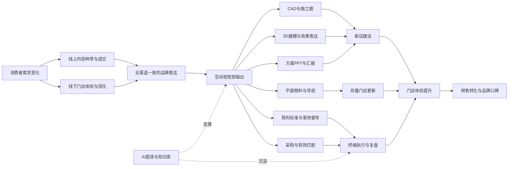
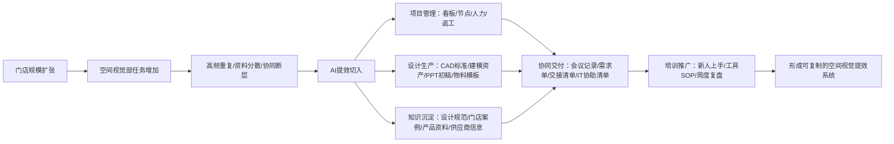

# 公司情况与业务环境

> 编写目的：帮助我理解源氏木语当前所处的业务阶段，以及空间视觉部为什么需要用 AI 做提效、沉淀和项目管理。
>
> 信息口径：本文结合公开网络资料、`AI推进.xlsx`、以及当前岗位所在的空间视觉部场景进行分析。公开资料中的门店数量存在不同时间口径，本文不把单一数字当作最终事实，而是将其理解为：源氏木语正处在大规模线下门店扩张与存量门店运营并行的阶段。

## 一句话判断

源氏木语正在从线上起家的实木家具品牌，进入“线上线下一体化、全国门店高速扩张、场景化体验驱动”的阶段。空间视觉部的价值不只是出图、建模和做方案，而是把品牌定位、产品矩阵、门店体验、建店标准和终端执行转化为一套可复制、可管理、可复盘的空间系统。

## 公开信息摘要

| 维度 | 公开信息 | 对空间视觉部的启发 |
| --- | --- | --- |
| 品牌与集团 | 源氏木语品牌创立于 2010 年，隶属于万木生源集团，业务覆盖家具及家居用品的设计、生产、销售。 | 空间视觉部需要服务的是一个成熟消费品牌，不是单一门店装修需求。设计输出要能承载品牌识别、产品表达和门店转化。 |
| 品牌定位 | 公开资料多次提到“做健康家具，创美好生活”、聚焦实木家具、高品质与健康环保。 | 门店空间需要突出实木材质、环保信任感、真实生活场景，而不只是陈列产品。 |
| 渠道结构 | 源氏木语已覆盖天猫、抖音、京东、拼多多、唯品会、亚马逊等线上渠道，同时持续扩展线下新零售门店。 | 线下门店承担体验、信任建立和成交转化作用。空间视觉要与线上商品、活动、卖点保持一致。 |
| 门店规模 | 公开信息显示门店规模从 500+、700+、1000+ 到 1500+ 等不同阶段口径持续增长，招聘信息中也提到未来线下新零售门店向 2000 家目标推进。 | 当前工作很可能面对“新店建设 + 存量升级 + 多城市复制”的高并发任务，单靠个人经验和人工整理会越来越难支撑。 |
| 产品矩阵 | 公开资料显示源氏木语有 20+ 产品系列、2500+ 在售产品，覆盖客厅、卧室、书房、餐厅、儿童房等空间，并包含多种风格。 | 门店设计需要处理大量产品、风格、场景组合，适合建立资料库、搭配规则、标准素材和 AI 辅助检索。 |
| 市场竞争 | 沙利文相关报道显示，2025 年中国实木家具市场竞争充分、同质化较明显，源氏木语获得实木家具、黑胡桃木家具、0 胶水床垫等销量认证。 | 线下空间要强化差异化：材质、工艺、环保、场景、生活方式，而不是只做“好看”。 |
| 数字化趋势 | 毕马威消费 50 报告指出，消费企业更重视数字化转型和以消费者为核心的运营管理；源氏木语也有 PLM/研发管理平台建设相关公开信息。 | AI 提效不应停留在“单点工具”，而应进入流程、项目、资料、复盘和协同管理。 |

## 业务环境图

## 对空间视觉部的核心影响

1. 门店规模化带来流程压力  
   新店、改店、活动物料、陈列调整、巡店问题会持续增加。空间视觉部需要从“接需求出结果”升级为“标准化接收、过程可见、资料可复用、结果可复盘”。

2. 场景化体验要求更高  
   家具产品需要被放进真实生活方式里展示。硬装、软装、创意、平面、陈列、采购不能只看各自任务，要共同服务“顾客到店后是否看得懂、愿意停留、相信品质、愿意成交”。

3. 线上线下一致性变重要  
   源氏木语线上渠道强，线下门店扩张快。门店空间、海报物料、导购话术、产品卖点和线上活动如果不统一，会削弱品牌体验。空间视觉部需要建立统一素材、标准语言和版本管理。

4. 设计产出需要从经验驱动走向系统驱动  
   CAD、建模、方案 PPT、物料设计、陈列督导、软饰采购等内容里有大量重复动作和可模板化动作。AI 可以先从“减少重复劳动、快速查资料、生成初稿、辅助校对、沉淀规范”开始，而不是一上来追求全自动。

5. 项目管理会成为提效关键  
   如果没有统一项目看板、资料归档、节点状态、返工原因和人力投入记录，就很难判断提效是否真实发生。AI 提效专员需要把“做了什么”变成“可统计、可复盘、可优化”的项目数据。

## 与中台相关的业务边界（摘要）

空间视觉项目中台把钉钉项目表作为初始化录入和外部事实输入，本地 SQLite 负责清洗、指标和运营看盘。系统长期区分三类判定：

- **公司阶段判定**：看板阶段、提醒和排序，说明流程推进到哪一步。
- **设计责任闭环**：硬装、软装、点位等责任线是否完成，不等于整个项目完成。
- **真实项目完成判定**：退出推进池和复盘归档，必须看最终交付/开业边界。

负责人责任身份、人员主数据策略和数据通道路由见 [`docs/contracts/personnel-and-responsibility-routing.md`](./docs/contracts/personnel-and-responsibility-routing.md)。

## 规则一览与 Deadline

中台开发文档的规则章节沉淀延期提醒、Deadline 和效率 KPI。硬装矩阵与工作日计算以 `src/backend/hardDecorationDeadlineRules.mjs` 为可执行权威；人类可读规则正文见 [`docs/rules/operational-rulebook.md`](./docs/rules/operational-rulebook.md)；前端 `#developer-docs` 页提供运营摘要。

## 空间视觉部可能面临的典型痛点

| 痛点类型 | 可能表现 | AI 或系统化切入点 |
| --- | --- | --- |
| 资料分散 | 标准、案例、图纸、模型、物料、供应商信息分散在个人电脑或群聊。 | 建立资料库目录、命名规则、标签体系、检索助手。 |
| 重复出图 | 相似店型、相似面积、相似物料反复从零开始。 | 店型模板、CAD/模型组件库、PPT 模板、提示词模板。 |
| 方案表达耗时 | 方案 PPT、风格说明、卖点表达、汇报逻辑需要大量人工整理。 | AI 辅助方案大纲、文案初稿、卖点归纳、图文排版建议。 |
| 跨团队信息断层 | 硬装、软装、平面、陈列、采购、督导交接标准不统一。 | 标准化会议记录、需求单、交接清单、项目看板。 |
| 返工原因不清 | 改图、换物料、陈列调整频繁，但缺少原因归类。 | 返工标签、问题库、复盘表、风险预警。 |
| 新人上手慢 | 新人不知道规范在哪里、案例怎么找、流程怎么走。 | 部门 AI 助手、SOP 知识库、案例问答库。 |
| IT需求零散 | 工具、权限、数据、接口、安全要求分散提出，难以统一推进。 | IT需求汇总表、优先级分级、数据权限清单。 |

## AI 提效的业务方向

## 对我当前岗位的结论

我的岗位不是单纯教大家用 ChatGPT、Midjourney 或某个 AI 画图工具，而是要先理解空间视觉部真实工作流，再把“痛点、资料、流程、工具、IT需求、衡量指标”组织成一套可落地的提效系统。

短期内，最重要的不是马上做一个很大的 AI 平台，而是先完成三件事：

1. 把各团队真实流程问清楚，形成会议记录和痛点地图。
2. 找出高频、重复、标准明确、影响周期的工作场景，先做小范围 AI 提效方案。
3. 把需要 IT 支持的权限、工具、数据、接口、存储和安全问题集中整理，避免零散沟通。

## 参考来源

- [上海万木生源家居有限公司招聘信息，智联招聘](https://www.zhaopin.com/companydetail/CZL1262027410.htm)
- [上海万木生源家居有限公司启动 SIPM/PLM 项目，思普软件](https://www.sipm.com.cn/news/detail/776?lng=zh)
- [青岛源氏木语家居有限公司线上线下同发力，中国经济网/经济日报](https://www.ce.cn/cysc/newmain/yc/jsxw/202308/03/t20230803_38657405.shtml)
- [毕马威中国消费50白皮书报告，毕马威中国](https://kpmg.com/cn/zh/home/insights/2024/01/kpmg-china-consumer-50.html)
- [源氏木语斩获中国实木家具等销量认证，新浪家居](https://sz.jiaju.sina.com.cn/zixun/20260205/7425011587167357408.shtml)
- [源氏木语入围第三届毕马威中国消费50榜单，今日家居](https://www.furnituretoday.cn/news/chn/3733.html)
